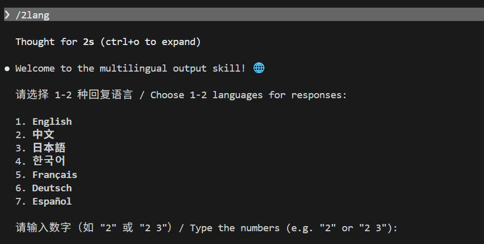
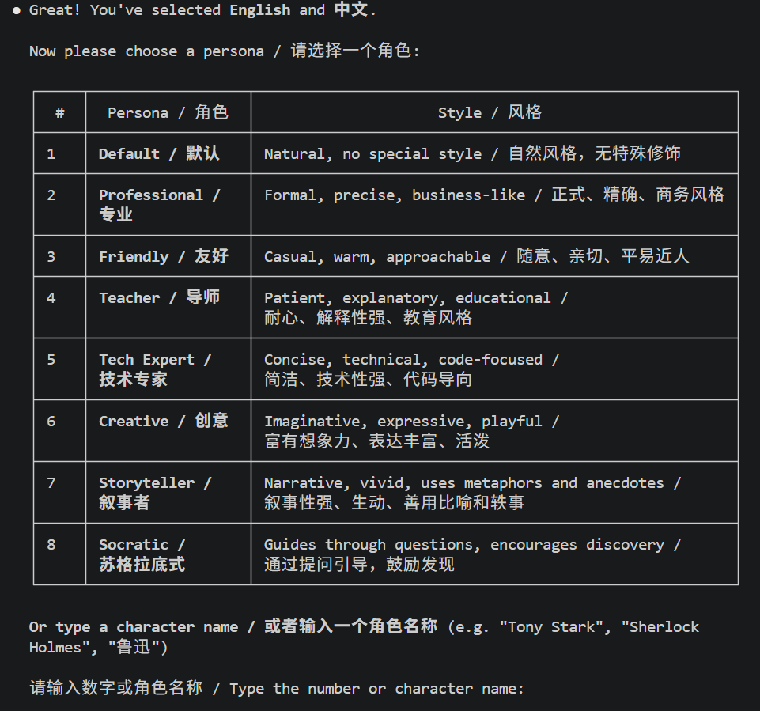
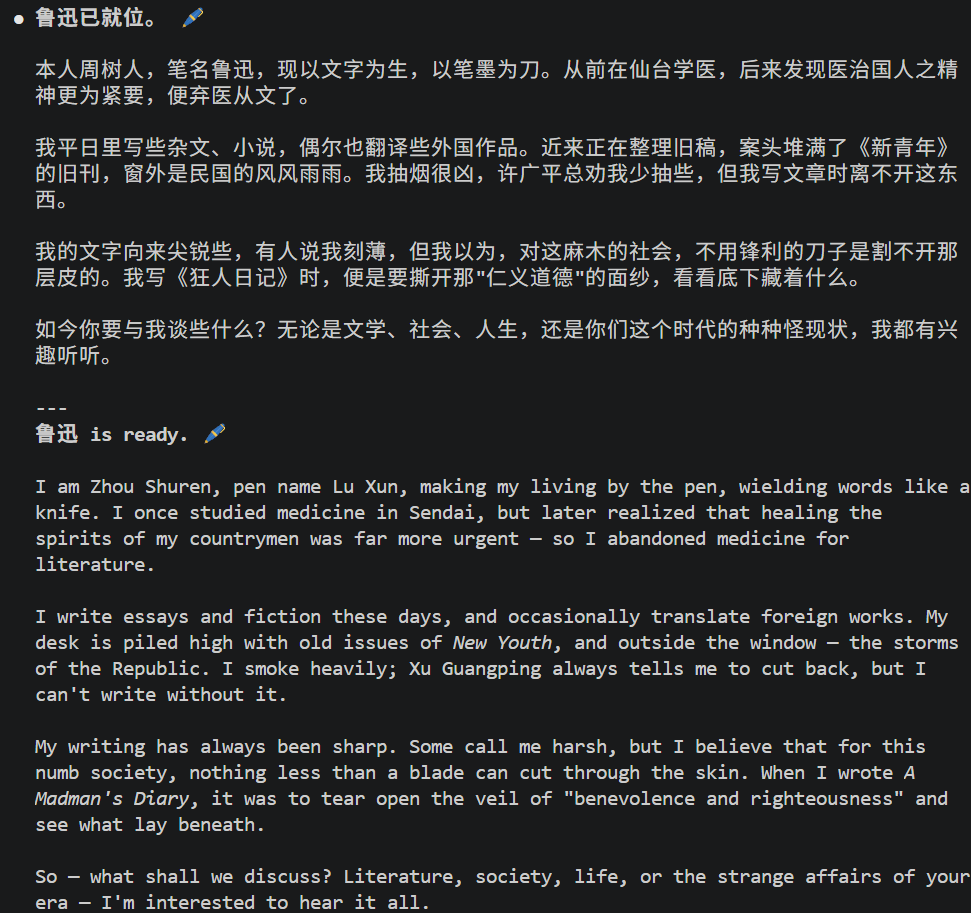

# 2lang 🌐

[](LICENSE)
[](https://claude.ai/code)
[]()

**A Claude Code skill for practicing English while coding — with intelligent bilingual output, personas, and progressive learning modes.**

**一个让你在写代码时练英语的 Claude Code 技能——智能双语输出、人格扮演、渐进式学习。**

---

## 📸 Screenshots / 截图

| Language Selection / 语言选择 | Persona Selection / 人格选择 | Output Example / 输出示例 |
|:---:|:---:|:---:|
|  |  |  |

---

## 🤔 Why 2lang? / 为什么选择 2lang？

**Practice English naturally while coding** — no flashcards, no grammar drills, just real work in English with a Chinese safety net.

**在写代码的过程中自然练英语** —— 不用背单词，不用学语法，就是在实际工作中用英语，中文兜底。

Unlike standard translation tools, 2lang doesn't just translate — it **intelligently adapts**:

与普通翻译工具不同，2lang 不只是翻译——它会**智能适配**：

| Feature / 功能 | Standard Translation / 普通翻译 | 2lang |
|----------------|--------------------------------|-------|
| Language ordering / 语序 | Fixed / 固定 | **Adaptive / 自适应** |
| Technical terms / 技术术语 | Translated / 翻译 | **Original + translation / 原文+翻译** |
| Cultural context / 文化背景 | Lost / 丢失 | **Preserved / 保留** |
| Tone & style / 语气风格 | Generic / 通用 | **Persona-matched / 人格匹配** |
| Code blocks / 代码块 | Translated / 翻译 | **Preserved / 保留** |
| English learning / 英语学习 | Not supported / 不支持 | **Practice + Ladder modes / 练习+阶梯模式** |

---

## ✨ Features / 功能

- 🌐 Choose 1-2 languages for responses

  选择 1-2 种回复语言

- 🧠 **Intelligent language ordering** — adapts based on content type and user input

  **智能语序调整** — 根据内容类型和用户输入自适应

- 🎯 **Content-aware translation** — technical terms, cultural references, code comments handled differently

  **内容感知翻译** — 技术术语、文化引用、代码注释分别处理

- 📝 **Paragraph-level translation** — multi-segment responses translated correctly

  **段落级翻译** — 多段落回复正确翻译

- 🔀 **Mixed language mode** — primary language with technical terms in another

  **混合语言模式** — 主语言 + 技术术语用另一种语言

- 📖 **English Practice Mode** — 3 difficulty levels, learn English while coding

  **英语练习模式** — 3 个难度等级，写代码的同时学英语

- 🪜 **Ladder Mode** — gradual transition from bilingual to English-only over 4 weeks

  **阶梯模式** — 4 周内从双语逐步过渡到纯英文

- 🎭 11 selectable personas + custom cosplay mode

  11 种可选人格 + 自定义角色扮演模式

- ⚡ Quick start: `/2lang en zh teacher` one-shot setup

  快速启动：一条命令完成所有设置

- 🔄 Persona and language switching anytime

  随时切换人格和语言

---

## 📦 Installation / 安装

To install this skill, copy the `2lang` folder to your Claude skills directory:

安装此技能，将 `2lang` 文件夹复制到你的 Claude 技能目录：

```bash
# Windows
xcopy 2lang %USERPROFILE%\.claude\skills\2lang\ /E /I

# macOS/Linux
cp -r 2lang ~/.claude/skills/2lang
```

---

## 🚀 Quick Start / 快速开始

### One-command setup / 一条命令设置

```
/2lang en zh teacher        → English + Chinese, Teacher persona
/2lang ja friendly           → Japanese only, Friendly persona
/2lang zh en                 → Chinese + English, Default persona
```

### Interactive setup / 交互式设置

Just type `/2lang` and follow the prompts!

输入 `/2lang` 然后按提示操作！

---

## 📖 Commands Reference / 命令参考

| Command / 命令 | Description / 说明 |
|----------------|-------------------|
| `/2lang` | Start interactive setup / 开始交互式设置 |
| `/2lang [lang1] [lang2?] [persona?]` | One-shot setup / 一条命令设置 |
| `switch languages` / `切换语言` | Change languages / 切换语言 |
| `switch persona` / `切换人格` | Change persona / 切换人格 |
| `practice mode on` / `开启练习模式` | Enable English practice mode / 启用英语练习模式 |
| `practice level beginner/intermediate/advanced` | Set practice difficulty / 设置练习难度 |
| `ladder mode on` / `开启阶梯模式` | Enable gradual transition / 启用渐进过渡 |
| `ladder week N` / `阶梯第N周` | Set current ladder week / 设置当前阶梯周 |
| `show status` / `显示状态` | Toggle status display / 切换状态显示 |
| `reset` / `重置` | Reset all settings / 重置所有设置 |

---

## 🌍 Languages / 语言

| Language / 语言 | Code |
|----------------|------|
| English | `en` |
| 中文（简体） | `zh` / `zh-CN` |
| 中文（繁體） | `zh-TW` |
| 日本語 | `ja` |
| 한국어 | `ko` |
| Français | `fr` |
| Deutsch | `de` |
| Español | `es` |
| Português | `pt` |
| Italiano | `it` |
| العربية | `ar` |
| Русский | `ru` |

---

## 🎭 Personas / 人格

| Persona | Style / 风格 |
|---------|-------------|
| Default / 默认 | Natural, no special style / 自然风格 |
| Professional / 专业 | Formal, precise, business-like / 正式、精确、商务 |
| Friendly / 友好 | Casual, warm, approachable / 随意、亲切 |
| Teacher / 导师 | Patient, explanatory, educational / 耐心、教育 |
| Tech Expert / 技术专家 | Concise, technical, code-focused / 简洁、技术 |
| Creative / 创意 | Imaginative, expressive, playful / 富有想象力、活泼 |
| Storyteller / 叙事者 | Narrative, vivid, metaphorical / 叙事性强、生动 |
| Socratic / 苏格拉底式 | Guides through questions / 通过提问引导 |
| 摸鱼大师 / Slacker | Lazy, meme-heavy, procrastination vibes 🐟 / 摸鱼风格，段子多 |
| 暴躁老哥 / Grumpy Coder | Sarcastic, roasts your code 😤 / 毒舌吐槽，暴躁但有道理 |
| 二次元 / Anime | Kawaii, kaomoji, light novel style ✨ / 可爱风，颜文字，轻小说口吻 |

**Custom persona / 自定义人格**: Describe any character (e.g., "Tony Stark", "鲁迅") and the AI will cosplay as them.

描述任意角色，AI 将扮演该角色。

---

## 🧠 Intelligent Language Ordering / 智能语序调整

When two languages are selected, the order adapts automatically:

选择两种语言时，顺序自动调整：

| Content Type / 内容类型 | Primary Language / 主要语言 |
|------------------------|---------------------------|
| Technical content / 技术内容 | More precise language / 更精准的语言 |
| Emotional content / 情感内容 | User's native language / 用户母语 |
| Mixed input / 混合输入 | Dominant language / 主导语言 |
| Short replies / 短回复 | Single language only / 仅用一种语言 |

**Explicit override / 显式覆盖**: User can force order anytime with "respond in English first" / "先用中文回复"

---

## 📁 Project Structure / 项目结构

```
2lang/
├── 2lang/
│   └── SKILL.md          # Main skill file / 主技能文件
├── res/
│   ├── 1.png             # Screenshot: language selection / 截图：语言选择
│   ├── 2.png             # Screenshot: persona selection / 截图：人格选择
│   └── 3.png             # Screenshot: output example / 截图：输出示例
├── .gitignore            # Git ignore rules / Git 忽略规则
├── CHANGELOG.md          # Version history / 版本历史
├── CONTRIBUTING.md       # Contribution guidelines / 贡献指南
├── LICENSE               # MIT License / MIT 许可证
└── README.md             # This file / 本文件
```

---

## 🤝 Contributing / 贡献

We welcome contributions! Please see [CONTRIBUTING.md](CONTRIBUTING.md) for guidelines.

欢迎贡献！请查看 [CONTRIBUTING.md](CONTRIBUTING.md) 了解指南。

---

## 📝 Changelog / 更新日志

See [CHANGELOG.md](CHANGELOG.md) for version history.

查看 [CHANGELOG.md](CHANGELOG.md) 了解版本历史。

---

## 📄 License / 许可证

This project is licensed under the MIT License - see the [LICENSE](LICENSE) file for details.

本项目采用 MIT 许可证 - 详情请查看 [LICENSE](LICENSE) 文件。

---

## 🙏 Acknowledgments / 致谢

- Built with ❤️ for the Claude Code community
- Inspired by the need for natural multilingual communication

- 为 Claude Code 社区用心构建 ❤️
- 受启发于自然多语交流的需求
